```code

⠀⠀⡶⠛⠲⣄⠀⠀⠀⠀⠀⠀⠀⠀⠀⠀⠀⠀⠀⠀⠀⠀⠀⠀⢠⡶⠚⢲⡀⠀  
⣰⠛⠃⠀⢠⣏⠀⠀⠀⠀⣀⣠⣤⣤⣤⣤⣤⣤⣤⣀⡀⠀⠀⠀⣸⡇⠀⠈⠙⣧  
⠸⣦⣤⣄⠀⠙⢷⣤⣶⠟⠛⢉⣁⣠⣤⣤⣤⣀⣉⠙⠻⢷⣤⡾⠋⢀⣠⣤⣴⠟  
⠀⠀⠀⠈⠳⣤⡾⠋⣀⣴⣿⣿⠿⠿⠟⠛⠿⠿⣿⣿⣶⣄⠙⢿⣦⠟⠁⠀⠀⠀  
⠀⠀⠀⢀⣾⠟⢀⣼⣿⠟⠋⠀⠀⠀⠀⠀⠀⠀⠀⠉⠻⣿⣷⡄⠹⣷⡀⠀⠀⠀  
⠀⠀⠀⣾⡏⢠⣿⣿⡯⠤⠤⠤⠒⠒⠒⠒⠒⠒⠒⠤⠤⠽⣿⣿⡆⠹⣷⡀⠀⠀  
⠀⠀⢸⣟⣠⡿⠿⠟⠒⣒⣒⣈⣉⣉⣉⣉⣉⣉⣉⣁⣒⣒⡛⠻⠿⢤⣹⣇⠀⠀  
⠀⠀⣾⡭⢤⣤⣠⡞⠉⠉⢀⣀⣀⠀⠀⠀⠀⢀⣀⣀⠀⠈⢹⣦⣤⡤⠴⣿⠀⠀  
⠀⠀⣿⡇⢸⣿⣿⣇⠀⣼⣿⣿⣿⣷⠀⠀⣼⣿⣿⣿⣷⠀⢸⣿⣿⡇⠀⣿⠀⠀  
⠀⠀⢻⡇⠸⣿⣿⣿⡄⢿⣿⣿⣿⡿⠀⠀⢿⣿⣿⣿⡿⢀⣿⣿⣿⡇⢸⣿⠀⠀  
⠀⠀⠸⣿⡀⢿⣿⣿⣿⣆⠉⠛⠋⠁⢴⣶⠀⠉⠛⠉⣠⣿⣿⣿⡿⠀⣾⠇⠀⠀  
⠀⠀⠀⢻⣷⡈⢻⣿⣿⣿⣿⣶⣤⣀⣈⣁⣀⡤⣴⣿⣿⣿⣿⡿⠁⣼⠟⠀⠀⠀  
⠀⠀⠀⢀⣽⣷⣄⠙⢿⣿⣿⡟⢲⠧⡦⠼⠤⢷⢺⣿⣿⡿⠋⣠⣾⢿⣄⠀⠀⠀  
⢰⠟⠛⠟⠁⣨⡿⢷⣤⣈⠙⢿⡙⠒⠓⠒⠓⠚⣹⠛⢉⣠⣾⠿⣧⡀⠙⠋⠙⣆  
⠹⣄⡀⠀⠐⡏⠀⠀⠉⠛⠿⣶⣿⣦⣤⣤⣤⣶⣷⡾⠟⠋⠀⠀⢸⡇⠀⢠⣤⠟  
⠀⠀⠳⢤⠼⠃⠀⠀⠀⠀⠀⠀⠈⠉⠉⠉⠉⠁⠀⠀⠀⠀⠀⠀⠘⠷⢤⠾⠁⠀  

```

> [!TIP]  
> Would you like to help? Knowledgeable people in areas like drones, marine biology, hydrometeorology, or people otherwise willing to help are more than welcome!  
> See [🙌 Help appreciated ](https://github.com/scherrer-txt/one-piece-location/discussions/6) for what needs doing atm, and create a [discussions](https://github.com/scherrer-txt/one-piece-location/discussions) thread if you have anything to share or ask

# One Piece Location
> [!CAUTION]  
> Status: **Ongoing**  
> Drop locations: **Toyama** (high confidence), **Sagami** (mid-high), **Suruga** (low)  
> Drop dates: **Feb. 13** for Toyama, **Feb. 17** for Sagami and Suruga  
> Weather: Temperature **≧ 10°C**, Wind speed **~5-6 knots**, **partly cloudy**  
> The One Piece: Chest (cca 140×100 mm), glass sphere (cca ⌀226 mm), frame (365×365 mm)  
> The ship: **Yamaha DX-51A-0B** (closest match yet)  
> The cargo ship: **Yet unknown AIS**, 50-100 m long, moving SE↖NW  
> The shrimp: **Pandalus hypsinotus** or **Pandalus nipponensis**  

### Done
- [x] Add [The One Piece](#the-one-piece)
- [x] Add screencaps from The Video (2026-03-11 2105 CET, [source](https://github.com/scherrer-txt/one-piece-location/commit/b1b14b9ec20d21e42a4376e6c4c927391177ba94))
- [x] Publish third iteration of findings (2026-03-08 01:40 CET, [source](https://github.com/scherrer-txt/one-piece-location/commit/a519be053de4b831441f4f55e4e4e2e27e40a1e6))
- [x] Repo clean-up (moved images to "./imgs")
- [x] Cross-reference clouds with satellite images of [Sagami](#sagami) and [Suruga](#suruga) to get dates for drop
- [x] Calculate the ship dimensions
- [x] Publish second iteration of findings about [Toyama](#toyama) (2026-03-06 13:42 CET, [source](https://github.com/scherrer-txt/one-piece-location/commit/c3d60c6e49b8c41c2e0e12354b4d5619415f838b))
- [x] Publish first iteration of findings about [Toyama](#toyama) (2026-03-04 05:55 CET, [source](https://github.com/scherrer-txt/one-piece-location/commit/588583ff3b75ac852f4afef8fa338f3647ba80ae))

# Gathered Info
## The Video
<a href="https://www.youtube.com/watch?v=O9M1UMj-vwE">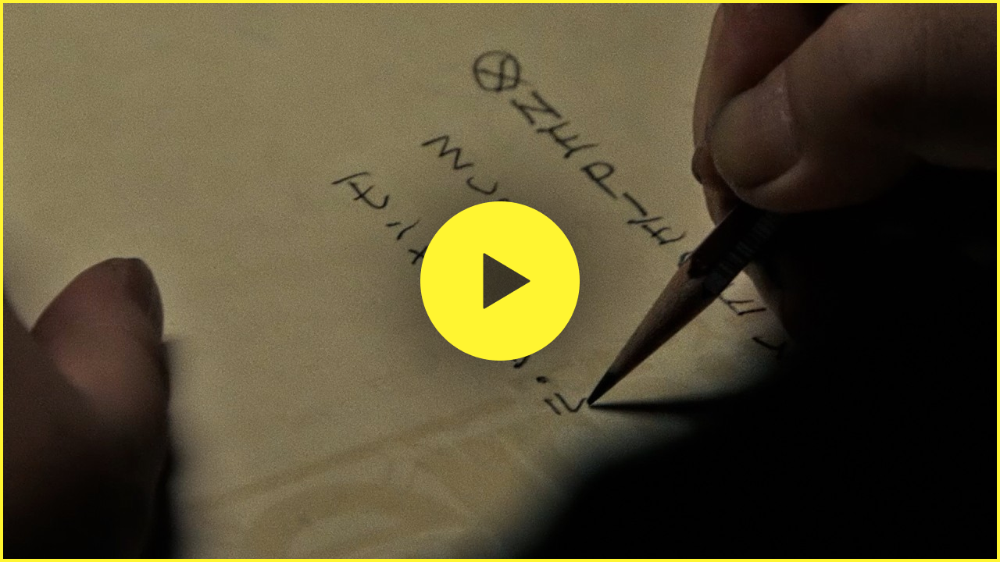</a>

## Timestamps
- [0:09](https://youtu.be/O9M1UMj-vwE?t=9) - Feb. 8, 2026 - 1:25 PM At Eiichiro Oda's studio
- [0:54](https://youtu.be/O9M1UMj-vwE?t=54) - Photo frame: 2602-C0233A
- [0:57](https://youtu.be/O9M1UMj-vwE?t=57) - Feb. 12, 2026 - 2:38 PM The chest is sealed in a pressure-resistant glass sphere
- [0:58](https://youtu.be/O9M1UMj-vwE?t=58) - Photo frame: 2602-C0189A
- [1:09](https://youtu.be/O9M1UMj-vwE?t=69) - Photo frame: 2602-C0043BN
- [1:13](https://youtu.be/O9M1UMj-vwE?t=73) - Feb. XX - 3:40 PM \[Local Time] Arrival at specified drop point
- [1:19](https://youtu.be/O9M1UMj-vwE?t=79) - 4:32 PM Deep-sea descent begins
- [1:29](https://youtu.be/O9M1UMj-vwE?t=89) - 4:51 PM 200m and descending
- [1:32](https://youtu.be/O9M1UMj-vwE?t=92) - 5:04 PM Sea floor touchdown at 651m
- [2:06](https://youtu.be/O9M1UMj-vwE?t=126) - "Onwards to flagless waters"

## Video description

<table>
  <thead>
    <tr>
      <th>Translation</th>
      <th>Rōmaji</th>
      <th>Original</th>
    </tr>
  </thead>
  <tbody>
    <tr>
      <td>~ "ONE PIECE" Worldwide Sales Exceed 600 Million Copies Celebration Project ~</td>
      <td>~ "ONE PIECE" Zensekai Ruikei Hakkō Busū Roku-oku-bu Toppa Kinen Kikaku ~</td>
      <td>~『ONE PIECE』全世界累計発行部数6億部突破記念企画​~</td>
    </tr>
    <tr>
      <td>That answer has been determined since the very beginning of the series. At long last, the secret has been written down by creator Eiichiro Oda, and now rests far beyond anyone’s reach at the bottom of the ocean.</td>
      <td>"ONE PIECE" to iu monogatari ga ugoki hajimeta toki kara, kimatte ita kotae. Sakusha Oda Eiichiro ni yotte kakishirusareta sono himitsu wa, ima mo dare no te mo todokanai kaitei de nemutte iru.</td>
      <td>『ONE PIECE』という物語が動きはじめたときから、決まっていた答え。​作者・尾田栄一郎によって書き記されたその秘密は、今も誰の手も届かない海底で眠っている。​</td>
    </tr>
    <tr>
      <td>Onwards to flagless waters.</td>
      <td>Hata naki umi e—</td>
      <td>旗なき海へ—​</td>
    </tr>
    <tr>
      <td>The piece of paper bearing the truth will be revealed after the story is complete.</td>
      <td>*Shinjitsu ga shirusareta shihen wa, monogatari no kanketsu-go ni kōkai o yotei shite imasu.</td>
      <td>​※真実が記された紙片は、物語の完結後に公開を予定しています。​</td>
    </tr>
    <tr>
      <td>Cooperation: JAMSTEC, Okamoto Glass Co., Ltd., and FullDepth Inc.</td>
      <td>Kyōryoku: Kokuritsu Kenkyū Kaihatsu Hōjin Kaiyō Kenkyū Kaihatsu Kikō (JAMSTEC), Okamoto Garasu Kabushikigaisha, Kabushikigaisha FullDepth</td>
      <td>​協力：国立研究開発法人海洋研究開発機構（JAMSTEC）・岡本硝子株式会社・株式会社FullDepth</td>
    </tr>
    <tr>
      <td>This video was filmed under the supervision of researchers from the Japan Agency for Marine-Earth Science and Technology (JAMSTEC) and the Cross-ministerial Strategic Innovation Promotion Program (SIP) Phase 3 to plan and conduct instrument deployment, retrieval and filming with due consideration for environmental protection, including potential impacts on the marine ecosystem. This project has been conducted with the intent of recovering all items placed on the seafloor.</td>
      <td>Hon dōga wa, SIP, JAMSTEC kenkyūin ni yoru kanshū ni yori sōchi no setchi, kaishū ya satsuei hōhō ni tsuite kentō o okonai, kankyō hozen ni kansuru hairyo no moto satsuei o jinshi shimashita. Kaitei setchibutsu ni tsuite wa kaishū o prantei ni shite orimasu.</td>
      <td>※本動画は、SIP(内閣府戦略的イノベーション創造プログラム第3期)、JAMSTEC（国立研究開発法人海洋研究開発機構）研究員による監修により装置の設置・回収や撮影方法について検討を行い、海洋生態系への影響等の環境保全に関する配慮のもと撮影を実施しました。海底設置物については回収を前提にしております。</td>
    </tr>
  </tbody>
</table>

## Video metadata
Nothing unusual, but this is as far as metadata examination of a YouTube video can take us.

```javascript
{{ “snippet”: {
"publishedAt": "2026-03-03T15:00:02Z",
"channelId": "UCdAHaWcKdpbT5XkN2Er6BUQ",
"title": "『ONE PIECE』全世界累計発行部数6億部突破記念企画「ONE PIECEとは？」",
"description": "#ONEPIECE  #ONEPIECE6億部\n\n~『ONE PIECE』全世界累計発行部数6億部突破記念企画​~\n\n『ONE PIECE』という物語が動きはじめたときから、決まっていた答え。​\n作者・尾田栄一郎によって書き記されたその秘密は、今も誰の手も届かない海底で眠っている。​\n\n旗なき海へ—​\n\n​※真実が記された紙片は、物語の完結後に公開を予定しています。​\n\n​協力：国立研究開発法人海洋研究開発機構（JAMSTEC）・岡本硝子株式会社・株式会社FullDepth\n\n---------------------------------------------------------------------------------------------------------------------------------\n\n※本動画は、SIP(内閣府戦略的イノベーション創造プログラム第3期)、JAMSTEC（国立研究開発法人海洋研究開発機構）研究員による監修により装置の設置・回収や撮影方法について検討を行い、海洋生態系への影響等の環境保全に関する配慮のもと撮影を実施しました。海底設置物については回収を前提にしております。",
"thumbnails": {
  "default": {
    "url": "https://i.ytimg.com/vi/O9M1UMj-vwE/default.jpg",
    "width": 120, "height": 90 },
  "medium": {
    "url": "https://i.ytimg.com/vi/O9M1UMj-vwE/mqdefault.jpg",
    "width": 320,
    "height": 180 },
  "high": {
    "url": "https://i.ytimg.com/vi/O9M1UMj-vwE/hqdefault.jpg",
    "width": 480,
    "height": 360 },
  "standard": {
    "url": "https://i.ytimg.com/vi/O9M1UMj-vwE/sddefault.jpg",
    "width": 640,
    "height": 480 },
  "maxres": {
    "url": "https://i.ytimg.com/vi/O9M1UMj-vwE/maxresdefault.jpg",
    "width": 1280,
    "height": 720 } },
"channelTitle": "ONE PIECE公式YouTubeチャンネル",
"categoryId": "1",
"liveBroadcastContent": "none",
"defaultLanguage": "ja",
"localized": {
  "title": "『ONE PIECE』全世界累計発行部数6億部突破記念企画「ONE PIECEとは？」",
  "description": "#ONEPIECE  #ONEPIECE6億部\n\n~『ONE PIECE』全世界累計発行部数6億部突破記念企画​~\n\n『ONE PIECE』という物語が動きはじめたときから、決まっていた答え。​\n作者・尾田栄一郎によって書き記されたその秘密は、今も誰の手も届かない海底で眠っている。​\n\n旗なき海へ—​\n\n​※真実が記された紙片は、物語の完結後に公開を予定しています。​\n\n​協力：国立研究開発法人海洋研究開発機構（JAMSTEC）・岡本硝子株式会社・株式会社FullDepth\n\n---------------------------------------------------------------------------------------------------------------------------------\n\n※本動画は、SIP(内閣府戦略的イノベーション創造プログラム第3期)、JAMSTEC（国立研究開発法人海洋研究開発機構）研究員による監修により装置の設置・回収や撮影方法について検討を行い、海洋生態系への影響等の環境保全に関する配慮のもと撮影を実施しました。海底設置物については回収を前提にしております。" },
"defaultAudioLanguage": "ja" }},

{ “statistics”: {
  "viewCount": "2827178",
  "likeCount": "72382",
  "favoriteCount": "0",
  "commentCount": "6335" }},

{ “status”: {
  "uploadStatus": "processed",
  "privacyStatus": "public",
  "license": "youtube",
  "embeddable": true,
  "publicStatsViewable": true,
  "madeForKids": false }}

{ “location”: { }},

{ “localizations”: {
  "en": {
    "description": "#ONEPIECE \n\nThat answer has been determined since the very beginning of the series.​\n\nAt long last, the secret has been written down by creator Eiichiro Oda, and now rests far beyond anyone’s reach at the bottom of the ocean.​\n\nOnwards to flagless waters.​\n\nThe piece of paper bearing the truth will be revealed after the story is complete.\n​-----------------------------------------------------------------------------------------------------------------------------\n\nThis video was filmed under the supervision of researchers from the Japan Agency for Marine-Earth Science and Technology (JAMSTEC) and the Cross-ministerial Strategic Innovation Promotion Program (SIP) Phase 3 to plan and conduct instrument deployment, retrieval and filming with due consideration for environmental protection, including potential impacts on the marine ecosystem. This project has been conducted with the intent of recovering all items placed on the seafloor.​\n\n協力：国立研究開発法人海洋研究開発機構（JAMSTEC）・岡本硝子株式会社・株式会社FullDepth",
    "title": "ONE PIECE: The 600 Million Milestone — What is the ONE PIECE?​​" },
  "ja": {
    "description": "#ONEPIECE  #ONEPIECE6億部\n\n~『ONE PIECE』全世界累計発行部数6億部突破記念企画​~\n\n『ONE PIECE』という物語が動きはじめたときから、決まっていた答え。​\n作者・尾田栄一郎によって書き記されたその秘密は、今も誰の手も届かない海底で眠っている。​\n\n旗なき海へ—​\n\n​※真実が記された紙片は、物語の完結後に公開を予定しています。​\n\n​協力：国立研究開発法人海洋研究開発機構（JAMSTEC）・岡本硝子株式会社・株式会社FullDepth\n\n---------------------------------------------------------------------------------------------------------------------------------\n\n※本動画は、SIP(内閣府戦略的イノベーション創造プログラム第3期)、JAMSTEC（国立研究開発法人海洋研究開発機構）研究員による監修により装置の設置・回収や撮影方法について検討を行い、海洋生態系への影響等の環境保全に関する配慮のもと撮影を実施しました。海底設置物については回収を前提にしております。",
    "title": "『ONE PIECE』全世界累計発行部数6億部突破記念企画「ONE PIECEとは？」" }},

{ “content-details”: {
  "duration": "PT2M10S",
  "dimension": "2d",
  "definition": "hd",
  "caption": "false",
  "licensedContent": true,
  "contentRating": {},
  "projection": "rectangular" }}
}
```

## Map
<table>
  <tr>
    <td>
      <a href="./imgs/src-1.png">
        
      </a>
  </td>
  <td>
      <a href="./imgs/src-2.png">
        
      </a>
  </td>
  </tr>
</table>

## Ship
<table>
  <tr>
  <td>
    <a href="./imgs/src-4.png">
      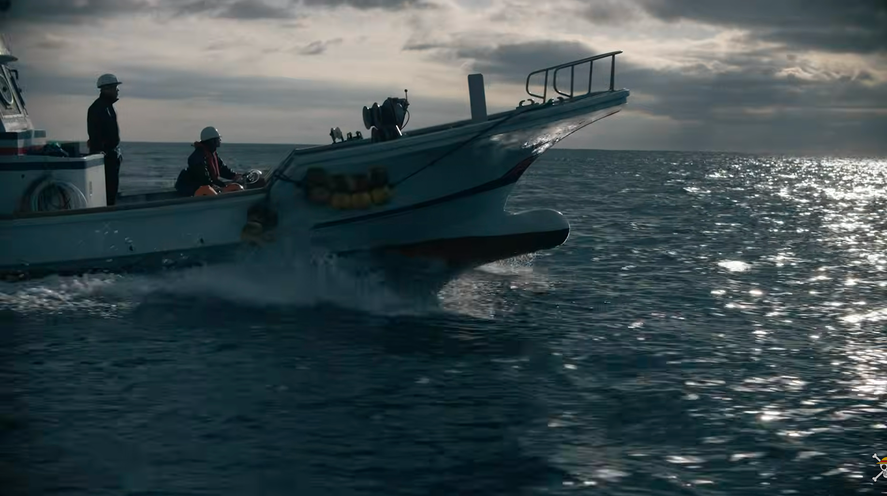
    </a>
  </td>
  <td>
    <a href="./imgs/src-5.png">
      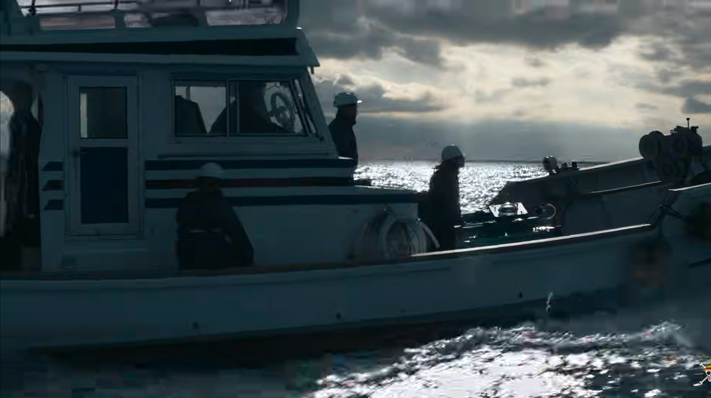
    </a>
    </td>
  </tr>
  <tr>
    <td>
      <a href="./imgs/src-6.png">
        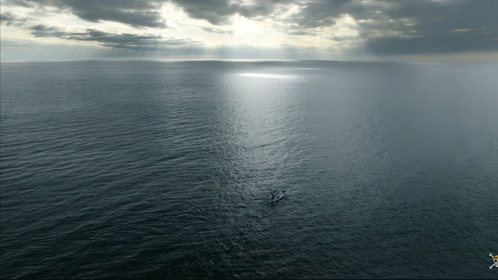
      </a>
    </td>
  </tr>
</table>

## Sea
<table>
  <tr>
    <td>
      <a href="./imgs/src-0.png">
        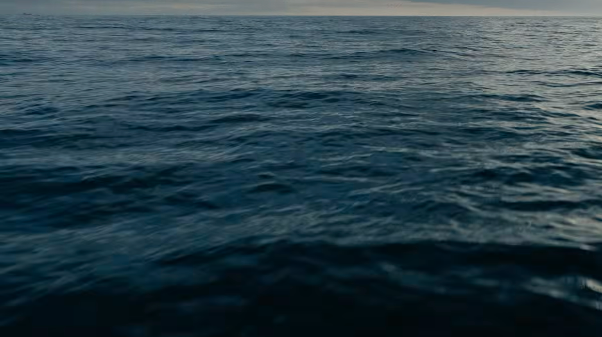
      </a>
    </td>
    <td>
      <a href="./imgs/src-3.png">
        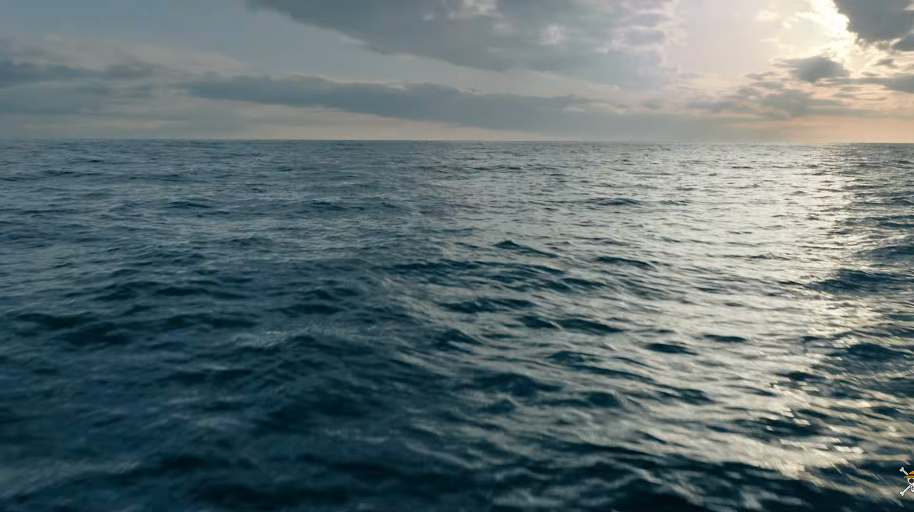
      </a>
    </td>
  </tr>
    <tr>
    <td>
      <a href="./imgs/src-6.png">
        
      </a>
    </td>
    <td>
      <a href="./imgs/src-8.png">
        
      </a>
    </td>
  </tr>
</table>

# Research
## The Drop: Location
> [!NOTE]  
> Drop locations: **Toyama** (high confidence), **Sagami** (mid-high), **Suruga** (low)  

### 0. Stitch the two maps from video:

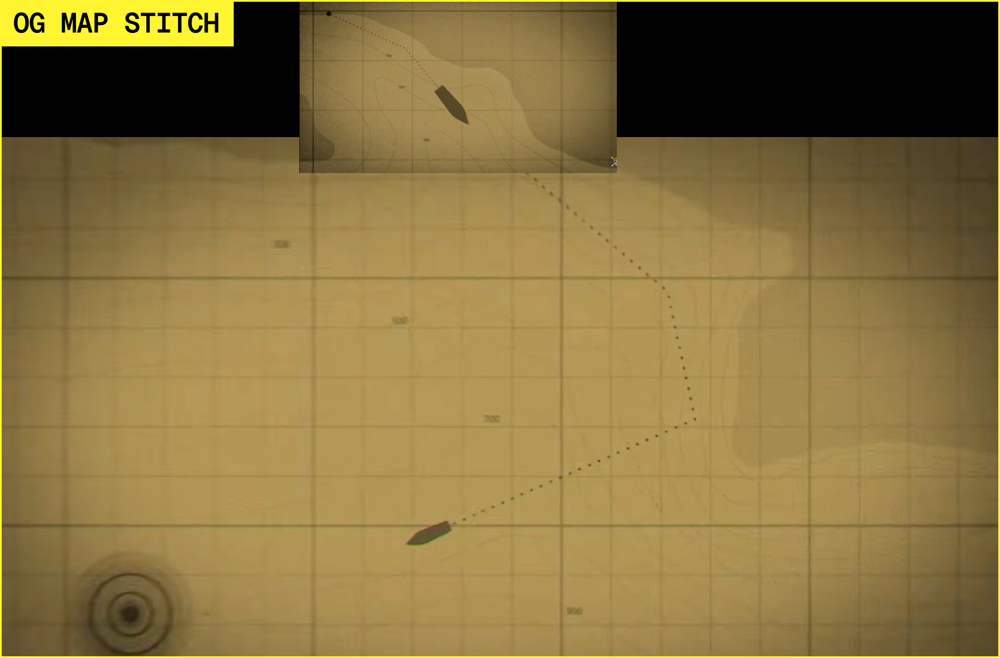

### 1. Redraw in vector (for better scaling)

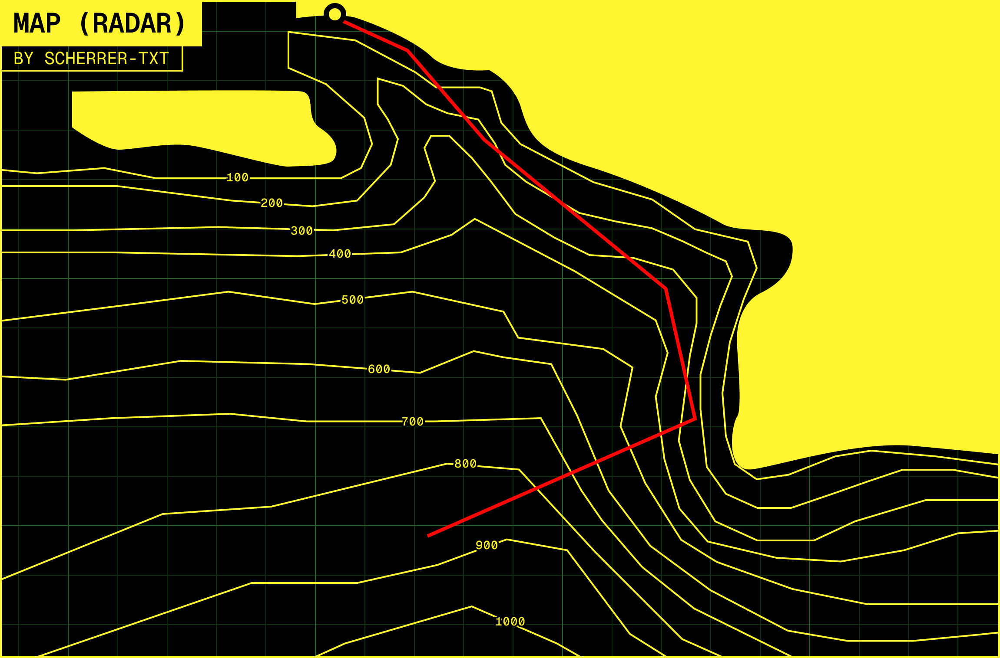


### 2. Location criteria:
- Shape of the coastline  
- Sea floor depth profile, has to be >600m deep, with a steep drop-off right from the coast. 
- Silt seafloor  
- **Flagless waters scenario**: Close to international waters (if the text at [2:06](https://youtu.be/O9M1UMj-vwE?t=126) "Onwards to flagless waters" would be understood as "international waters")  
- ~~Near ship harbor presence~~  
- ~~No mountains or significant landscape in view when taking into account the possition of the Sun on the ship footage~~  


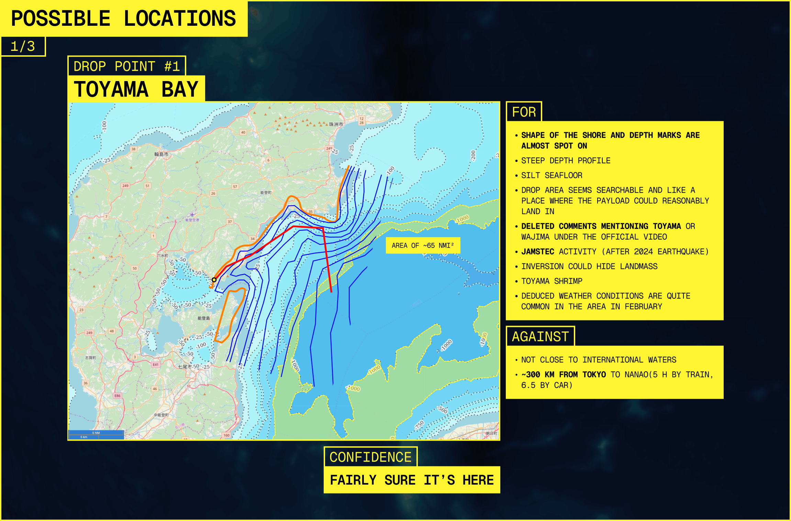

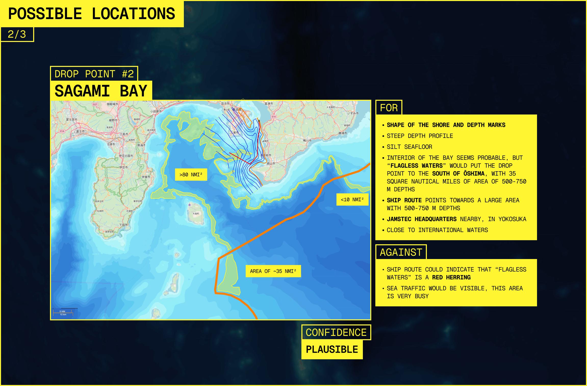

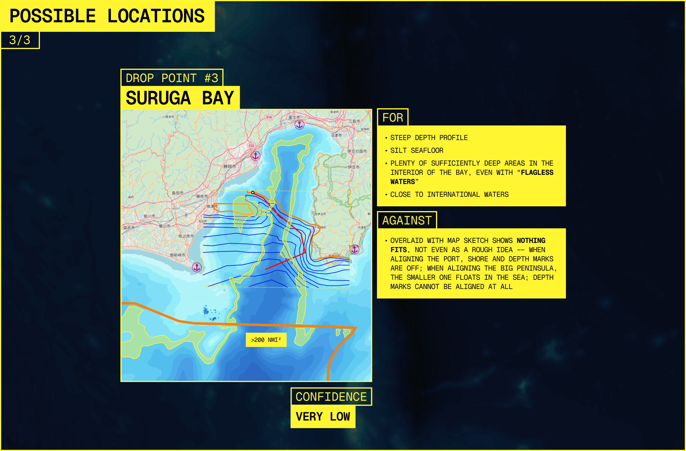

## The Drop: Date
> [!NOTE]  
> Possible dates for Toyama: **13.** (best candidate), 16., 18., 19., 24., 27.  
> Possible dates for Sagami: 14., 16., **17.**, 20., 22., 24., 27.  
> Possible dates for Suruga: **17.**, 22., 24., 27.  
> Confidence: Moderate-high  
> Status: 🟡 Need to cross-reference with weather report (key conditions to look for: partly cloudy, 5 knots wind speed, air temperature ≧ 10°C)  

### 0. Date criteria
- At [0:57](https://youtu.be/O9M1UMj-vwE?t=57) the text reads "Feb. 12, 2026 - 2:38 PM The chest is sealed in a pressure-resistant glass sphere", so the drop could happen anytime after that, but taking into account the needed logistics, Feb. 12 is highly unlikely
- Text at [1:13](https://youtu.be/O9M1UMj-vwE?t=73) reads "Feb. XX - 3:40 PM \[Local Time] Arrival at specified drop point", which means the drop couldn't happen later than 28th of February
- **13-28 February is the timeframe**

### 1. Weather criteria
- Sky has to be relatively open, partly cloudy, combination of low-altitude heavy clouds and wispy high-altitude ones
- Weather has to be condusive for dramatic crepuscular rays (inversion, atmospheric haze, wispy high-altitude clouds)

### 2. Light criteria
- The drop was finished before sunset
- The shadows of the ship are long and fall toward the North/Northeast, which means the ship faces West in all frames


### 4. Dataset
> [!NOTE]  
> **Filtering criteria**:
> **Suitable**: Combination of wispy cirrus and cirrostratus with clearly defined stratocumulus clouds  
> **Unsuitable**: Heavy overcast or clear skies over Toyama, Suruga or Sagami bays  

> [!TIP]  
> - 🟢 = accepted  
> - 🟡 = unsure  
> - 🔴 = rejected  


## The One Piece
> [!NOTE]  
> Dimensions: Chest (cca 140×100 mm), glass sphere (cca ⌀226 mm), frame (365×365 mm)  
> Confidence: High  
> Status: 🟢 Done  

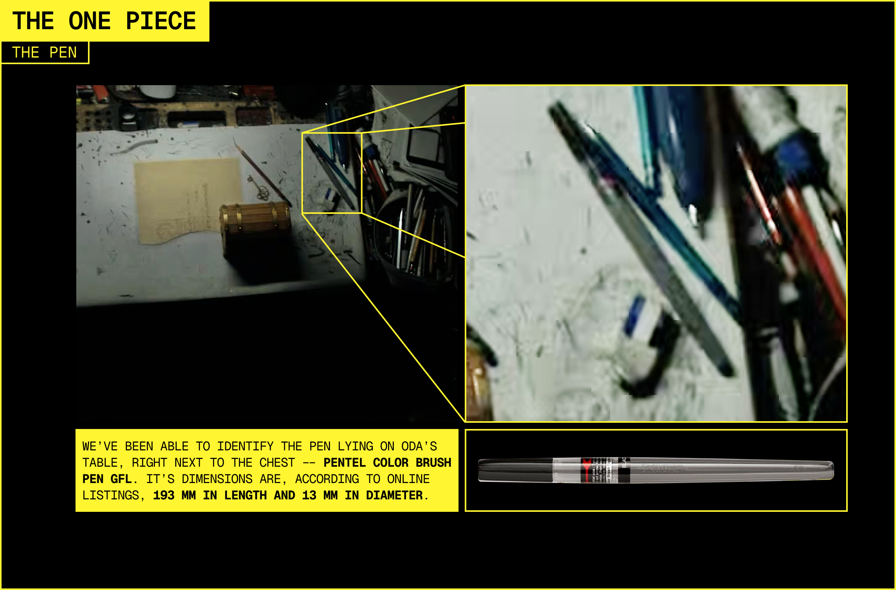

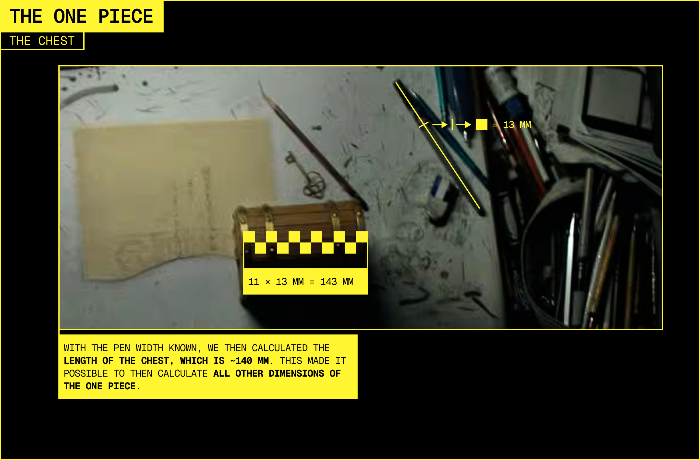

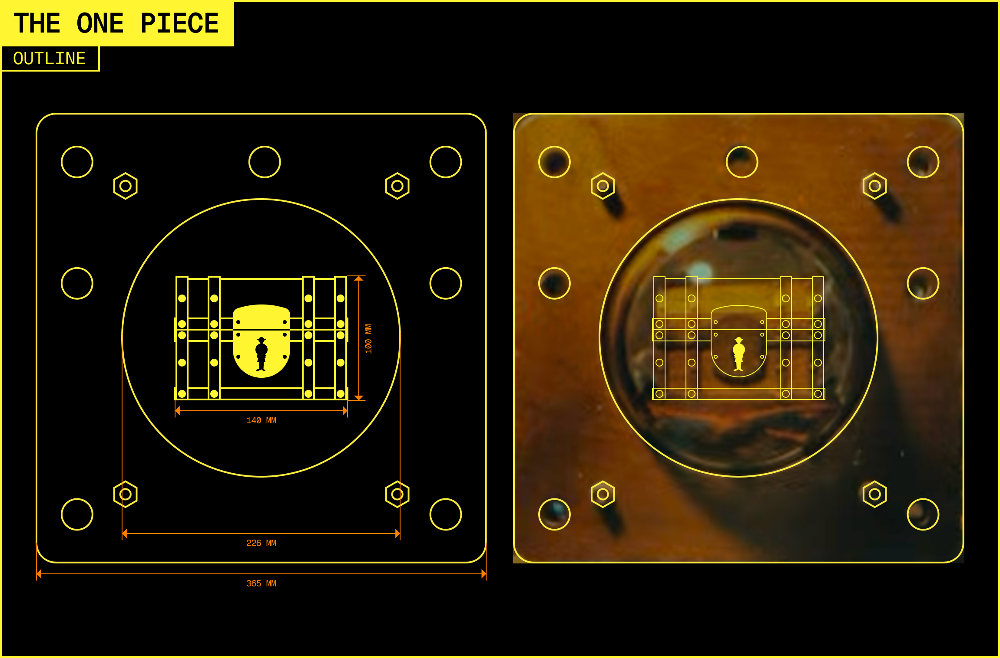

## The Sea
> [!NOTE]  
> Sea state 1, Beaufort 2, wind speed was ~5-6 knots  
> Confidence: High  
> Status: 🟢 Done  

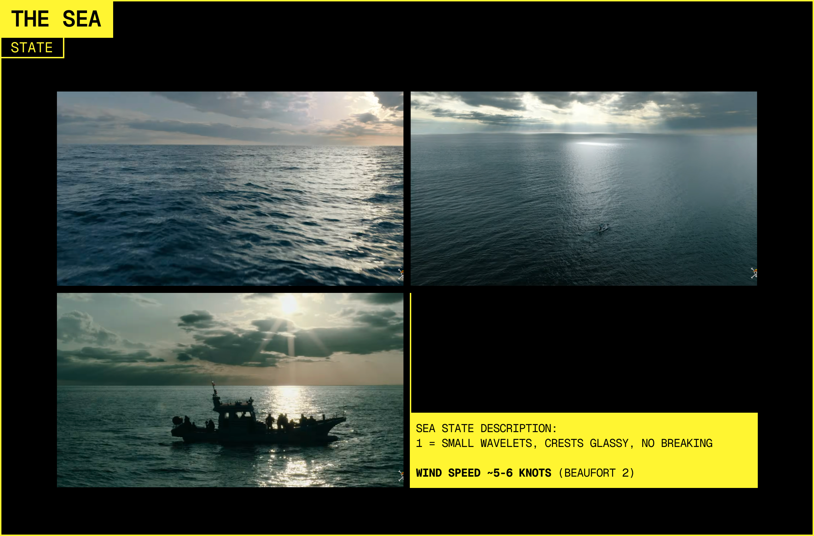

## The Code
> [!NOTE]  
> Either a cryptogram (pointing at manga chapters) or a classification code used for naming production assets  
> Confidence: Moderate-low  
> Status: 🟡 Further research is due  

We are probably looking at either a cryptogram or some kind of a classification code. If the former is true, we tried to assign meaning to the code based on a key below; if the latter is true, then it is a somewhat dead end -- the question still remains why they used these specific pictures and this specific kind of classification code.

### Notable observations:
- Last code, accompanying a photo of seagulls, points to a manga chapter opening with a frame of seagulls flying over Going Merry
- First two codes have 6 character after the "-", but the last one has 7 characters
- For now it doesn't seem like any standard classification system has been used to name these pictures
- Only three frames in the whole video are displayed like this (black background and split in two videos/pictures), and all three have this kind of a code

### The key:
- 2602: Year and month in YYMM format
- C: Might mean manga chapter¹
- NNNN: Might be the chapter number (four letters would make sense since there are now 1176 chapters)
- A/BN: These letters might point to specific text bubbles, but we're still unsure what they really mean.

¹: We thought about anime episodes too, but since Oda is primarily the author of the manga, which is his primary medium of choice, and has less creative control over the anime, it would make sense to limit the research to manga only. That being said, we looked into the anime too, the code seems to correspond to episode 233 ("The Pirate Kidnapping Incident and the Pirate Ship Waits for Death!", arc Water 7), episode 189 ("Eternal Friendship! The Bell of Oath Echoes Throughout the Giant Ocean!!", arc Skypiea) and episode 43 ("The End of the Fish-Man Empire! Nami is My Friend!", arc Arlong Park)

### Source

> Timestamp: [0:54](https://youtu.be/O9M1UMj-vwE?t=54)
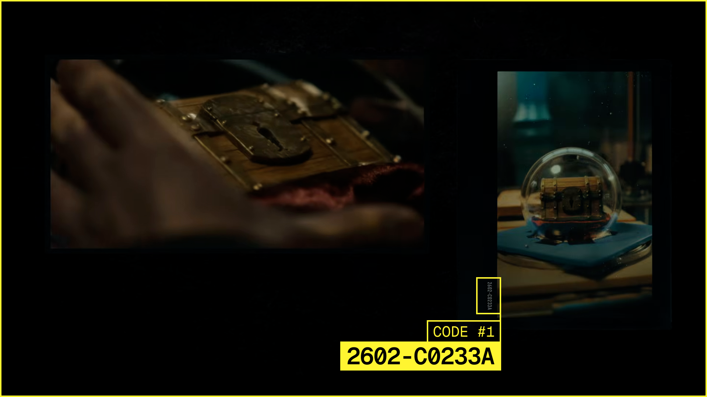

> Timestamp: [0:58](https://youtu.be/O9M1UMj-vwE?t=58)
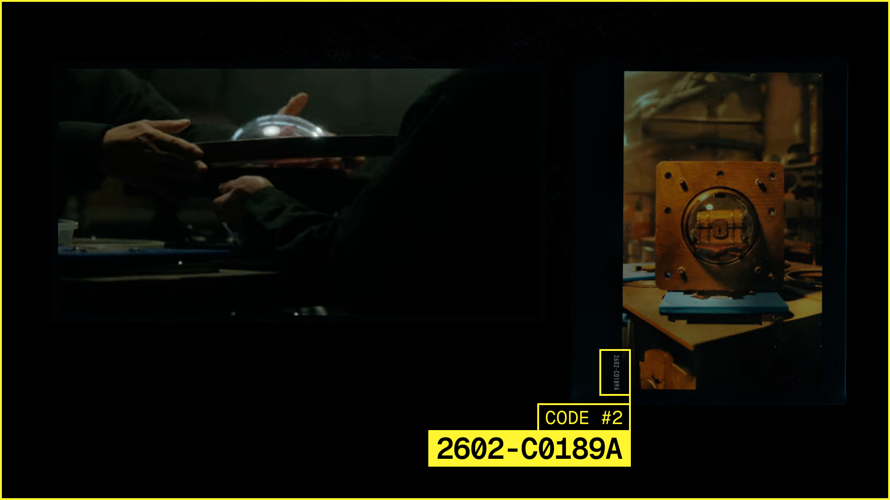

> Timestamp: [1:09](https://youtu.be/O9M1UMj-vwE?t=69)
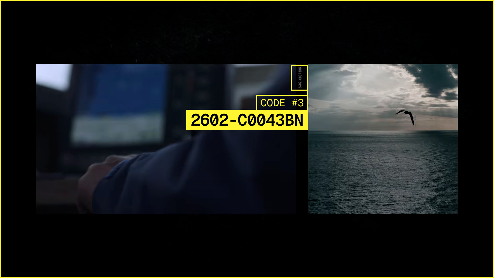

### Findings

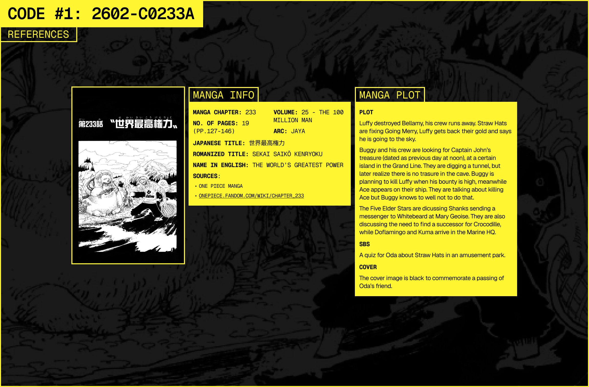

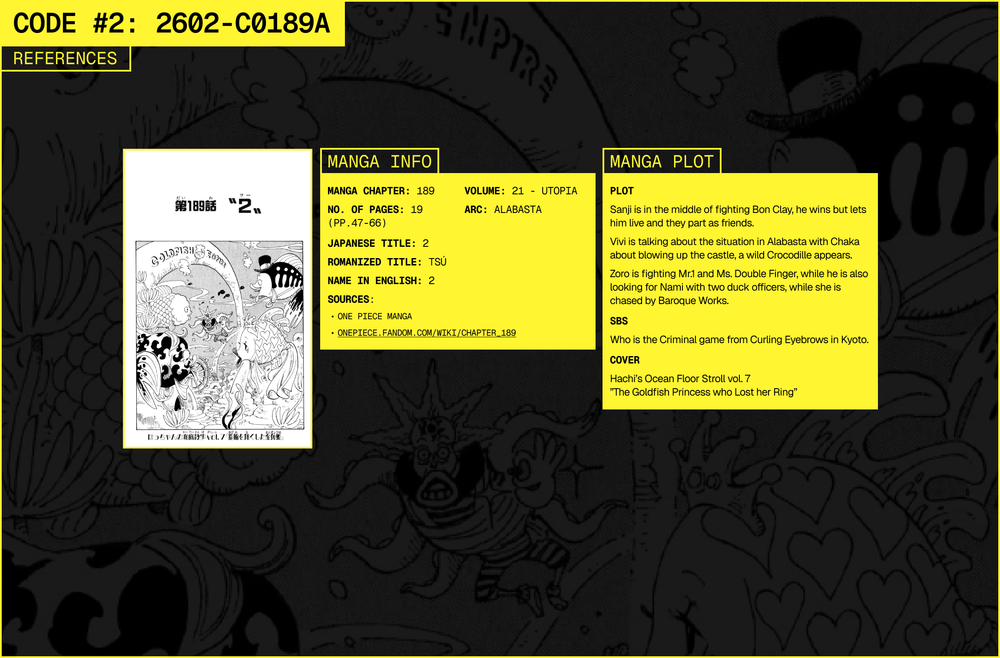

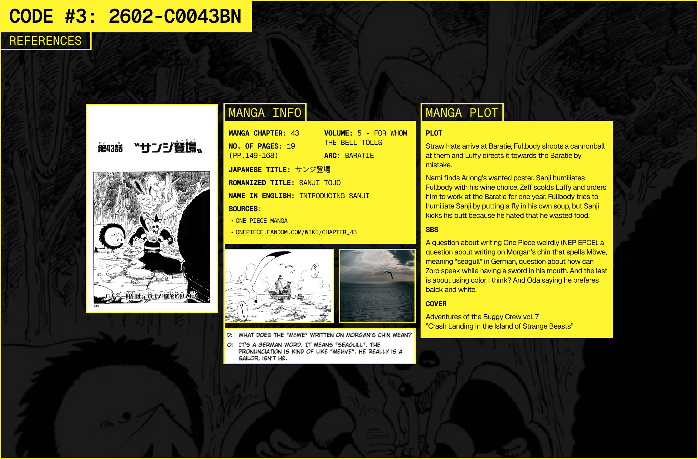

## The Ship
> [!NOTE]  
> The ship is 14 m long, 5 meter wide  
> Model: Yamaha DX-51A-0B (closest match)  
> Owner: JAMSTEC  
> Confidence: High  
> Status: 🟢 Done, but some information are still missing (callname, model, AIS number)  

The shape of the bow (ram bow close to the waterline) allows riding *through* waves even at high speeds (rather than riding on top of them, which would produce an up-and-down motion), which is rather unusual for a fishing vessel of this size.  

Connection to Japan Coast Guard seems highly unlikely, since their vessels are visibly marked as such. JAMSTEC appears to be the most probable owner of this ship, since their budget would allow ordering a custom-built ship or modifying one for research purposes, for which reducing any unnecessary motion would be needed.  

While AIS (Automatic Identification System) is a useful tool for tracking vessels, this ships gross tonnage falls below the mandatory threshold, it would be voluntary at this point. Given the nature of the mission, it is fairly safe to assume the crew had AIS turned off.

Concerning the model of the ship, if it's not custom-built, then closest match is [Yamaha DX-51A-0B](https://www.hokkaido-marine.co.jp/product/dx51a0b/). While the shape of the bow is close to the ship used for the drop, there are numerous differences in the shape of the center console (doors should be next to the side windows, not under them; front windows are 2 panes divided by a column, both have scanwipers). It could be an older model by the same manufacturer (assumed by the shape and look of the doors).

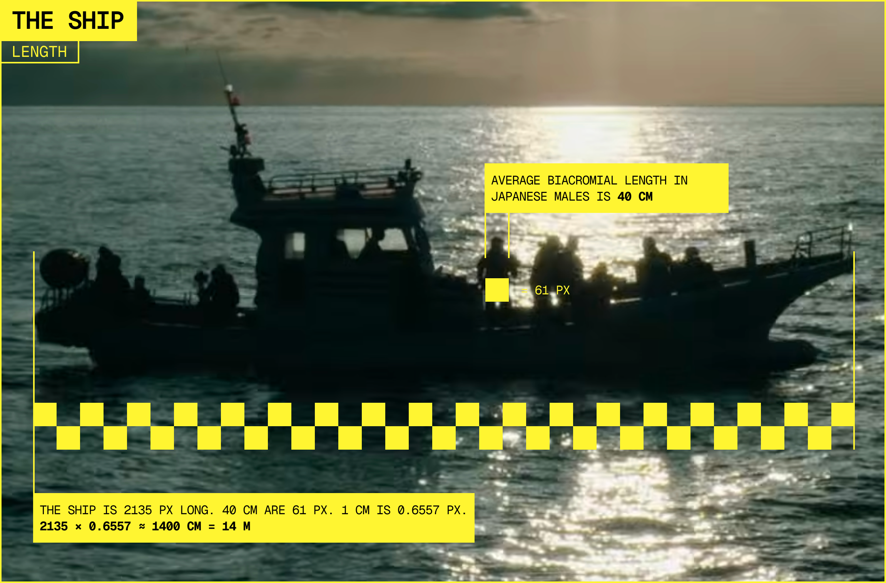

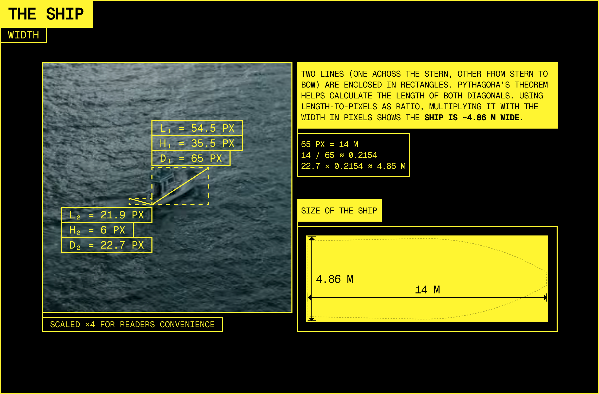

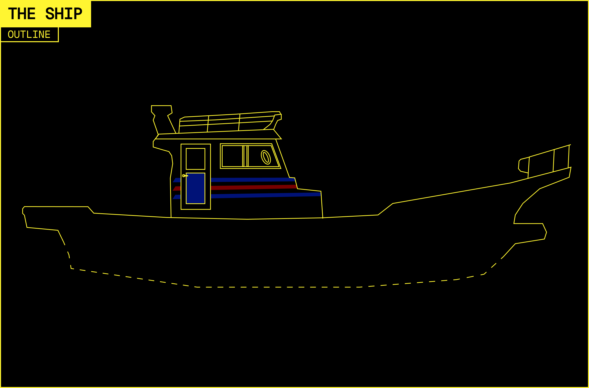

## The Other Ship
> [!NOTE]  
> Vessel type: Cargo ship  
> Length: 50-100 m  
> Confidence: Moderate-low  
> Status: 🟡 Further research is due (approximate length, callname, AIS number)  

A cargo ship is visible right on the horizon in the top right part of the frame at [1:02](https://youtu.be/O9M1UMj-vwE?t=62). Its estimated gross tonnage appears to be sufficient to trigger mandatory AIS.

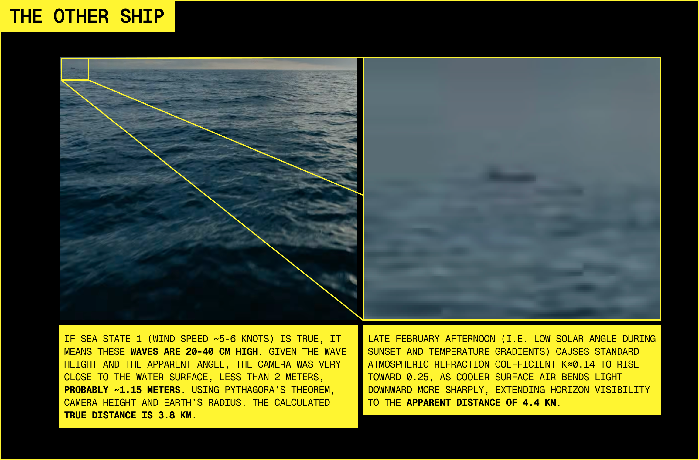

# The Shrimp
> [!NOTE]  
> Shrimp species: *Pandalus hypsinotus* or *Pandalus nipponensis*  
> Confidence: Moderate-high  
> Status: 🟢 Done

Most probably either *Pandalus hypsinotus* (known also as **Toyama** shrimp) or *Pandalus nipponensis* (observed both in **Suruga** and **Sagami**, in depths over 500 m). Adult pandalus shrimp can have as much as 20 centimeters in length.


# Outcomes
## Toyama
> [!NOTE]  
> **Place**: ~14 km south of Noto  
> **Date**: February 13th  
> **Time**: 16:32  
> **Wind**: 2.57 m/s W  
> **Visibility**: 10.00 km  
> **Cloud cover**: Partly Cloudy  

### Reasoning
0. **COAST**: The shape of the coast on **the map aligns almost perfectly with coastline of Toyama bay**.
1. **WEATHER**: Shores of Noto peninsula, with hills up to 300 m above sea level (visible from as far as 60 km on clear day), should be visible from the drop point, as they are only ~6.5 NM away. But considering the weather conditions of transition from winter to spring, like temperature inversion (air temp. rises while the water remains near 10-12°C, creating a layer of moisture near the surface; **such air temp. rise to 10°C was recorded on 2026-02-13** between 1-2 PM.), resulting atmospheric **haze could obscure shores of Noto**, even at a relatively close ~12 km range -- this would also help **produce crepuscular rays** like in the video. Overcast sky would produce flat, directionless light.
2. **JAMSTEC**: Following the 2024 Noto Peninsula earthquake, **Toyama bay seafloor has intensive ongoing research** and hight-tech effort to remap the seafloor (JAMSTEC) which would render the needed infrastructure for deep sea projects available.  
3. **Every comment under the video mentioning "Toyama bay" was deleted**, while others mentioning Suruga or Sagami were left untouched. In marketing campaigns for treasure hunts, mods often filter out correct answer to prevent spoiler from trending too early, while leaving red herrings (Sagami/Suruga) to keep the engagement high. *While suggestive, it's inconclusive at best*, since moderation policy is opaque.
4. **Flagless waters scenario**: Does not apply, this theory is only true when the payload was never in International waters, but deployed inside the Japan Exclusive Economic Zone, in a highly researched and monitored area on top of that.

### Notes
- There is also a shrimp in a frame of the video. It is probably worth mentioning that there lives a species of shrimp called **Toyama shrimp in the bay**.  
- The fact that there were **giant squids** found in Toyama, which at the time of the drop begin their seasonal Diel vertical migration, could be interesting for some.

## Sagami
> [!NOTE]  
> **Place**: ~28 km south of Ōshima  
> **Date**: TBA  
> **Time**: 16:32  
> **Wind**: TBA  
> **Visibility**: TBA  
> **Cloud cover**: Partly Cloudy  

### Reasoning
0. **COAST**: Sagami bay seems like the **next most possible option**, given that both the **coastline and depth profiles align perfectly**. Not only that, even the **ship route points towards** a large area of 500-750 m depths.
1. **WEATHER**: TBA
2. **JAMSTEC**: **It's closeness to Tokyo and JAMSTEC headquarters in Yokosuka would appear to lend it more weight**, since moving the film crew and the payload itself would be easier than to 300+ km far away Toyama. Although the maritime equippment would available on-site or for a rent around Toyama bay, moving the crew and the payload itself from Tokyo would be a 300+ km journey.
3. **Flagless waters scenario**: Applies, it would put the drop point ~15 NM south of Ōshima, with 35 square nautical miles of area with 500-750 m depths.

### Notes
- The apparent **lack of any meaningful sea traffic** in shots is concerning, as Sagami bay/Kaneda bay are **very busy**, since they lead to Tokyo harbor, but the shots in the video were deliberate and picked to show the vastness of the sea. What was left on the editting table is unknown.
- The aligned ship route could indicate that **“Flagless waters” is a red herring**, leading any possible adventurers **safely into International waters**, rather than into japanese waters.

# Suruga
> [!NOTE]  
> **Place**: Multiple choices  
> **Date**: Same as Sagami  
> **Time**: 16:32  
> **Wind**: TBA  
> **Visibility**: TBA  
> **Cloud cover**: Partly Cloudy  

### Reasoning
0. **COAST**: **Nothing fits**. Depth marks, coastline, ship route. But it still has plenty of sufficiently deep areas in the interior of the bay.
1. **WEATHER**: Given the proximity to Sagami bay, the same weather conditions would apply for both.
2. **JAMSTEC**: There is some presence.
3. **Flagless waters scenario**: Applies, as it is close to international waters and also has a lot of 500-750 m deep areas.

### Notes
- I cannot stress enough that when overlaid with map sketch shows nothing fits, not even as a rough idea -- when aligning the port, shore and depth marks are off; when aligning the big peninsula, the smaller one floats in the sea; depth marks cannot be aligned at all.

# Team
- scherrer-txt (head of research)
- [Lea_be_snappy](https://www.instagram.com/lea_be_snappy/) (research associate)
- [maro95amv](https://www.reddit.com/user/maro95amv/) (research associate)
- [LUKEPPP89](https://github.com/LUKEPPP89) (research associate)

# Tools
- No AI/LLM model was used to create any part of our findings (images nor text)
  - Gemini and Claude were used for brainstorming only, every hallucination was thoroughly researched by a human and either proved or disproved
  - Perplexity was used to find sources, which were then verified and read by a human
- [OpenSeaMap](https://map.openseamap.org/)
- [JAXA Himawari Monitor](https://www.eorc.jaxa.jp/ptree/index.html)
- [SunEarthTools.com](https://www.sunearthtools.com/dp/tools/pos_sun.php)
- [Weather Spark](https://weatherspark.com/)
- [DuckDuckGo](https://duckduckgo.com/)
- [FFMPEG](https://github.com/FFmpeg/FFmpeg)
- Google Earth
- Google

# Sources
- ["ONE PIECE" Worldwide Sales Exceed 600 Million Copies - "What is ONE PIECE?"](https://www.youtube.com/watch?v=O9M1UMj-vwE)
- [Online Anthropometry: Chapter 2 - Definition and applicability of the Anthropometric data - 18. Shoulder breadth (biacromial)](https://personal.cityu.edu.hk/meachan/online%20anthropometry/chapter2/Ch2-18.htm)
- [USA National Weather Service - Beaufort Scale](https://www.weather.gov/pqr/beaufort) and [USA National Weather Service - Guide to: Sea State, Wind, and Clouds](https://www.weather.gov/media/marine/SeaState.pdf)
- [NZ Metservice - Sea State and Swell](https://blog.metservice.com/Sea_State_and_Swell)
- [Astronoo How far is the horizon?](https://astronoo.com/en/articles/horizon.html), [Firgelli Automations Distance To Horizon calculator](https://www.firgelliauto.com/blogs/engineering-calculators/distance-to-horizon-calculator) and [YesCalculator Atmospheric Refraction Distance calculator](https://www.yescalculator.com/en/tool/atmospheric-refraction-distance-calculator.html)
- [Kasaya, T., Minami, H., Okino, K. et al. Submarine landslides caused by the 2024 Noto Peninsula earthquake. Earth Planets Space 77, 72 (2025). https://doi.org/10.1186/s40623-025-02204-x](https://doi.org/10.1186/s40623-025-02204-x)
- [genus Pandalus](https://www.godac.jamstec.go.jp/bismal/j/occurrences?taxon=0001051) on JAMSTEC Biological Information System for Marine Life
- [genus Pandalus](https://www.marinespecies.org/aphia.php?p=taxdetails&id=107044) on World Register of Marine Species  
- [Yamaha DX-51A-0B](https://www.hokkaido-marine.co.jp/product/dx51a0b/)
- Pentel Color Brush Pen GFL [Pentel Store](https://penstore.ie/ie/pentel/color-brush-pigment-black), [E-bay listing](https://www.ebay.com/itm/205157652603), [Parka Blog review](https://www.parkablogs.com/content/review-pentel-color-brush-pens)
- [“Nose Jobs” For Ships – Reason Behind Retrofitting Bulbous Bow](https://www.marineinsight.com/naval-architecture/nose-jobs-for-ships-reasons-behind-retrofitting-bulbous-bow/)
- [Droneversus - FOV](https://droneversus.com/field-of-view)
