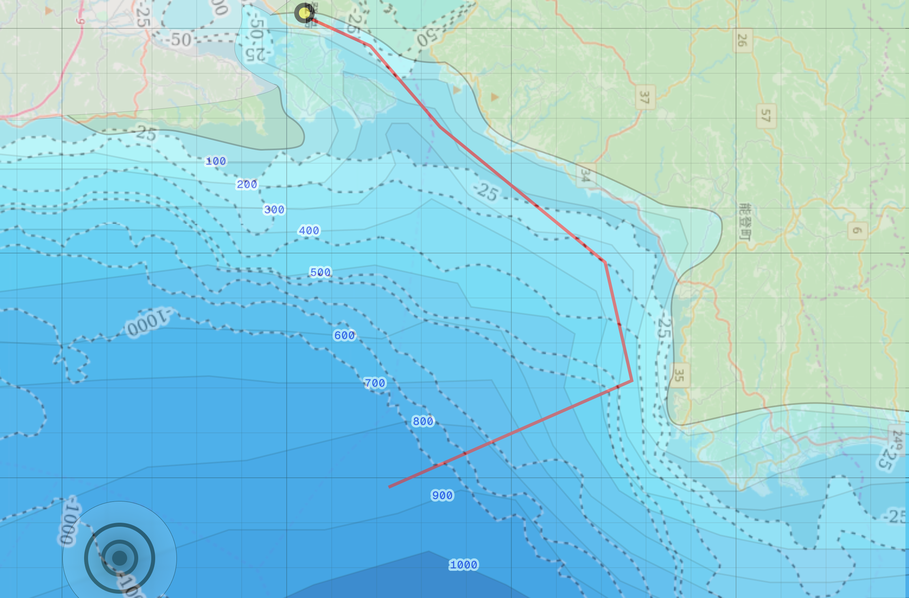

```code

⠀⠀⡶⠛⠲⣄⠀⠀⠀⠀⠀⠀⠀⠀⠀⠀⠀⠀⠀⠀⠀⠀⠀⠀⢠⡶⠚⢲⡀⠀  
⣰⠛⠃⠀⢠⣏⠀⠀⠀⠀⣀⣠⣤⣤⣤⣤⣤⣤⣤⣀⡀⠀⠀⠀⣸⡇⠀⠈⠙⣧  
⠸⣦⣤⣄⠀⠙⢷⣤⣶⠟⠛⢉⣁⣠⣤⣤⣤⣀⣉⠙⠻⢷⣤⡾⠋⢀⣠⣤⣴⠟  
⠀⠀⠀⠈⠳⣤⡾⠋⣀⣴⣿⣿⠿⠿⠟⠛⠿⠿⣿⣿⣶⣄⠙⢿⣦⠟⠁⠀⠀⠀  
⠀⠀⠀⢀⣾⠟⢀⣼⣿⠟⠋⠀⠀⠀⠀⠀⠀⠀⠀⠉⠻⣿⣷⡄⠹⣷⡀⠀⠀⠀  
⠀⠀⠀⣾⡏⢠⣿⣿⡯⠤⠤⠤⠒⠒⠒⠒⠒⠒⠒⠤⠤⠽⣿⣿⡆⠹⣷⡀⠀⠀  
⠀⠀⢸⣟⣠⡿⠿⠟⠒⣒⣒⣈⣉⣉⣉⣉⣉⣉⣉⣁⣒⣒⡛⠻⠿⢤⣹⣇⠀⠀  
⠀⠀⣾⡭⢤⣤⣠⡞⠉⠉⢀⣀⣀⠀⠀⠀⠀⢀⣀⣀⠀⠈⢹⣦⣤⡤⠴⣿⠀⠀  
⠀⠀⣿⡇⢸⣿⣿⣇⠀⣼⣿⣿⣿⣷⠀⠀⣼⣿⣿⣿⣷⠀⢸⣿⣿⡇⠀⣿⠀⠀  
⠀⠀⢻⡇⠸⣿⣿⣿⡄⢿⣿⣿⣿⡿⠀⠀⢿⣿⣿⣿⡿⢀⣿⣿⣿⡇⢸⣿⠀⠀  
⠀⠀⠸⣿⡀⢿⣿⣿⣿⣆⠉⠛⠋⠁⢴⣶⠀⠉⠛⠉⣠⣿⣿⣿⡿⠀⣾⠇⠀⠀  
⠀⠀⠀⢻⣷⡈⢻⣿⣿⣿⣿⣶⣤⣀⣈⣁⣀⡤⣴⣿⣿⣿⣿⡿⠁⣼⠟⠀⠀⠀  
⠀⠀⠀⢀⣽⣷⣄⠙⢿⣿⣿⡟⢲⠧⡦⠼⠤⢷⢺⣿⣿⡿⠋⣠⣾⢿⣄⠀⠀⠀  
⢰⠟⠛⠟⠁⣨⡿⢷⣤⣈⠙⢿⡙⠒⠓⠒⠓⠚⣹⠛⢉⣠⣾⠿⣧⡀⠙⠋⠙⣆  
⠹⣄⡀⠀⠐⡏⠀⠀⠉⠛⠿⣶⣿⣦⣤⣤⣤⣶⣷⡾⠟⠋⠀⠀⢸⡇⠀⢠⣤⠟  
⠀⠀⠳⢤⠼⠃⠀⠀⠀⠀⠀⠀⠈⠉⠉⠉⠉⠁⠀⠀⠀⠀⠀⠀⠘⠷⢤⠾⠁⠀  

```

# One Piece IRL Location
Based on video ["ONE PIECE" Worldwide Sales Exceed 600 Million Copies - "What is ONE PIECE?"](https://www.youtube.com/watch?v=O9M1UMj-vwE) (orig.:『ONE PIECE』全世界累計発行部数6億部突破記念企画「ONE PIECEとは？」)

## Content
- Gathered Info
  - [Timestamps](#timestamps)
  - [Map](#map)
  - [Ship](#ship)
  - [Video description](#video-description)
- [Deduction process](#deduction-process)
- [Reasoning](#reasoning)
- [Conclusion](#conclusion)
- [Tools](#tools)

# Gathered Info
## Timestamps
- @[1:13](https://youtu.be/O9M1UMj-vwE?t=73) - Feb. XX - 3:40 PM \[Local Time] Arrival at specified drop point
- @[1:19](https://youtu.be/O9M1UMj-vwE?t=79) - 4:32 PM Deep-sea descent begins
- @[1:29](https://youtu.be/O9M1UMj-vwE?t=89) - 4:51 PM 200m and descending
- @[1:32](https://youtu.be/O9M1UMj-vwE?t=92) - 5:04 PM Sea floor touchdown at 651m

## Map
<table>
<tr>
    <td>
        <a href="src-1.png">
            
        </a>
    </td>
    <td>
        <a href="src-2.png">
            
        </a>
    </td>
</tr>
</table>

## Ship
<table>
<tr>
    <td>
        <a href="src-3.png">
            
        </a>
    </td>
    <td>
        <a href="src-4.png">
            
        </a>
    </td>
</tr>
<tr>
    <td>
        <a href="src-5.png">
            
        </a>
    </td>
    <td>
        <a href="src-6.png">
            
        </a>
    </td>
</tr>
<tr>
    <td>
        <a href="src-7.png">
            
        </a>
    </td>
</tr>
</table>

## Video description
<table>
  <thead>
    <tr>
      <th>Translation</th>
      <th>Rōmaji</th>
      <th>Original</th>
    </tr>
  </thead>
  <tbody>
    <tr>
      <td>~ "ONE PIECE" Worldwide Sales Exceed 600 Million Copies Celebration Project ~</td>
      <td>~ "ONE PIECE" Zensekai Ruikei Hakkō Busū Roku-oku-bu Toppa Kinen Kikaku ~</td>
      <td>~『ONE PIECE』全世界累計発行部数6億部突破記念企画​~</td>
    </tr>
    <tr>
      <td>The answer to this question has been clear since the beginning of the "ONE PIECE" story. The secret, written down by author Eiichiro Oda, still lies hidden beneath the ocean floor, unreachable to anyone.</td>
      <td>"ONE PIECE" to iu monogatari ga ugoki hajimeta toki kara, kimatte ita kotae. Sakusha Oda Eiichiro ni yotte kakishirusareta sono himitsu wa, ima mo dare no te mo todokanai kaitei de nemutte iru.</td>
      <td>『ONE PIECE』という物語が動きはじめたときから、決まっていた答え。​作者・尾田栄一郎によって書き記されたその秘密は、今も誰の手も届かない海底で眠っている。​</td>
    </tr>
    <tr>
      <td>To a Sea Without a Flag—</td>
      <td>Hata naki umi e—</td>
      <td>旗なき海へ—​</td>
    </tr>
    <tr>
      <td>*The piece of paper bearing the truth is scheduled to be made public after the story is concluded.</td>
      <td>*Shinjitsu ga shirusareta shihen wa, monogatari no kanketsu-go ni kōkai o yotei shite imasu.</td>
      <td>​※真実が記された紙片は、物語の完結後に公開を予定しています。​</td>
    </tr>
    <tr>
      <td>Cooperation: JAMSTEC, Okamoto Glass Co., Ltd., and FullDepth Inc.</td>
      <td>Kyōryoku: Kokuritsu Kenkyū Kaihatsu Hōjin Kaiyō Kenkyū Kaihatsu Kikō (JAMSTEC), Okamoto Garasu Kabushikigaisha, Kabushikigaisha FullDepth</td>
      <td>​協力：国立研究開発法人海洋研究開発機構（JAMSTEC）・岡本硝子株式会社・株式会社FullDepth</td>
    </tr>
    <tr>
      <td>This video was filmed under the supervision of researchers from SIP and JAMSTEC, who considered the installation/retrieval of equipment and filming methods, taking environmental conservation into account. Seafloor installations will be retrieved.</td>
      <td>Hon dōga wa, SIP, JAMSTEC kenkyūin ni yoru kanshū ni yori sōchi no setchi, kaishū ya satsuei hōhō ni tsuite kentō o okonai, kankyō hozen ni kansuru hairyo no moto satsuei o jinshi shimashita. Kaitei setchibutsu ni tsuite wa kaishū o prantei ni shite orimasu.</td>
      <td>※本動画は、SIP(内閣府戦略的イノベーション創造プログラム第3期)、JAMSTEC（国立研究開発法人海洋研究開発機構）研究員による監修により装置の設置・回収や撮影方法について検討を行い、海洋生態系への影響等の環境保全に関する配慮のもと撮影を実施しました。海底設置物については回収を前提にしております。</td>
    </tr>
  </tbody>
</table>

# Deduction process
### 1. Put the two maps from video together:


### 2. Redraw in vector to capture details
<table>
<tr>
    <td>
        <a href="map-2.png">
            
        </a>
    </td>
    <td>
        <a href="map-3.png">
            
        </a>
    </td>
</tr>
</table>

### 3. Look for parts of Japan coast that fit these parameters:
  - Shape of the coastline  
  - Near ship harbor presence  
  - Sea floor depth profile (has to be >600m deep, with a steep drop-off right from the coast)  
  - No mountains or significant landscape in view when taking into account the possition of the Sun on the ship footage  


### 5. Most possible match: Noto Peninsula, Toyama Bay




# Reasoning
- The shape and depth on the map shown in video checks out with depth profile of that part of Toyama bay.
- The position of the Sun at the time of the drop suggests that frames featuring the ship are looking towards the city of Nanao.
  - 
- Shores of Noto peninsula should be visible from the drop point, as it is only ~12 km away (and since there are some hills up to 300 m above sea level, on clear day visible from as far as 60 km). But since the drop happened in mid/late february, I believe we have to take into account the atmospheric haze happening during transition from winter to spring (air temperature rises while the water remains near 10-12℃, this temperature inversion creates a layer of moisture near the surface, obscuring shores, even at a relatively close ~12 km range).
- Every comment I made under the video mentioning "Toyama bay" was deleted, while others mentioning Suruga or Sagami were left there. In digital marketing campaigns for treasure hunts, moderators often prune the correct answer to prevent the spoiler from trending too early, while leaving red herrings (Sagami/Suruga) to keep the engagement high.
- While Sagami bay could seem like go-to option, I think that there would be simply too much traffic, since the bay leads to Tokyo. It's closeness to Tokyo would appear to lend it more weight, since moving the film crew and the payload itself would be easier than to 300+ km far away Nanao/Toyama, but then again, the depth profile checks out with Toyama; Sagami is much more jagged in this regard.
- There were giant squids found in Toyama bay, which at the time of the drop begin their seasonal Diel vertical migration.
- Following the 2024 Noto Peninsula earthquake, seafloor of Toyama bay has intensive ongoing research and hight-tech effort to remap the seafloor (by JAMSTEC) which would render the needed infrastructure for deep sea projects available. I think it's much easier for a film crew to "piggyback" on existing maritime operations or rent a specialized research vessel already stationed in Toyama/Nanao for earthquake study than to bring one up from Tokyo.
- Toyama bay is a "natural fish tank" with a steep drop-off to 1,000m-1,200m. A 651 m touchdown puts the payload on the upper slope of the Toyama Trough, likely on a stable ledge away from the high-sediment "canyons" where river runoff flows. This depth is deep enough to be "unreachable" by anyone but professionals, but shallow enough for the remotely operated vehicles used in the video to operate efficiently.

# Conclusion
I believe One Piece is somewhere around 37°09'32.44"N 137°10'18.85"E

---

# Other Notes
### Weight of the payload
- Since the payload was released at 16:32 and touched the seafloor (651 m) at 17:04, that gives us 32 minutes = 1,920 seconds, with average Velocity (v): ≈0.34 m/s. Given the water density in February in the Sea of Japan is increased (≈1027 kg/m³)
  - With the Depth, Water Density (ρ) in this part of the year and Total Descent Time noted, Terminal Velocity (Vt) of the object is:
    - Vt = 651 / 1920 = **0.34 m/s**
  - This can help with estimation of the weight of the probe in water, if we take note of the Drag Coefficient (1) and Surface Area (~0.40 m²):
    - Wnet​ = 0.5 ​× ρ × Cd × A × Vt²
    - Wnet = 0.5 ​× 651 ​× 1 ​× 0.4 ​× 0.34² = 15 Kg
  - **Pure speculation**: Weight on the air could be somewhere around ~80 kg for whole probe, ~15 Kg for only the One Piece part.

# Tools
- [OpenSeaMap](https://map.openseamap.org/)
- [SunEarthTools.com](https://www.sunearthtools.com/dp/tools/pos_sun.php)
- Google Earth
- Google Gemini for some calculations
